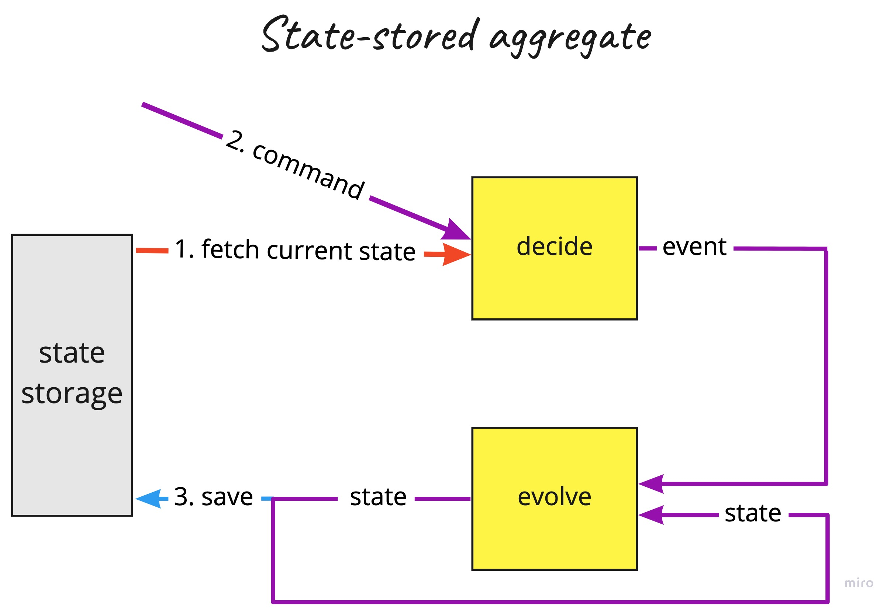
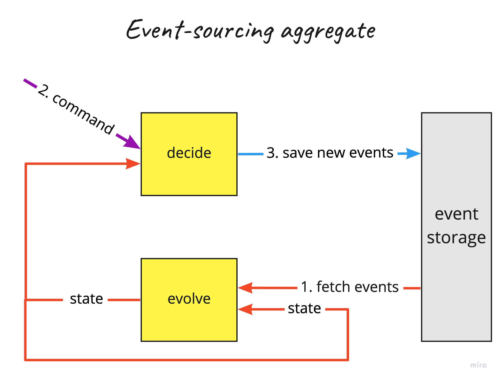

## Application(s)

Orchestrates the execution of the logic declared in [domain](../domain)

Different application/adapter implementations are using the common/unique [domain model](../domain).

### State stored systems

- [State stored System 1](state-stored-system1) - combines all Deciders from [domain module](../domain) under one Aggregate root by using inheritance structure of messages (messages extend common class)

### Event sourced/stored systems

