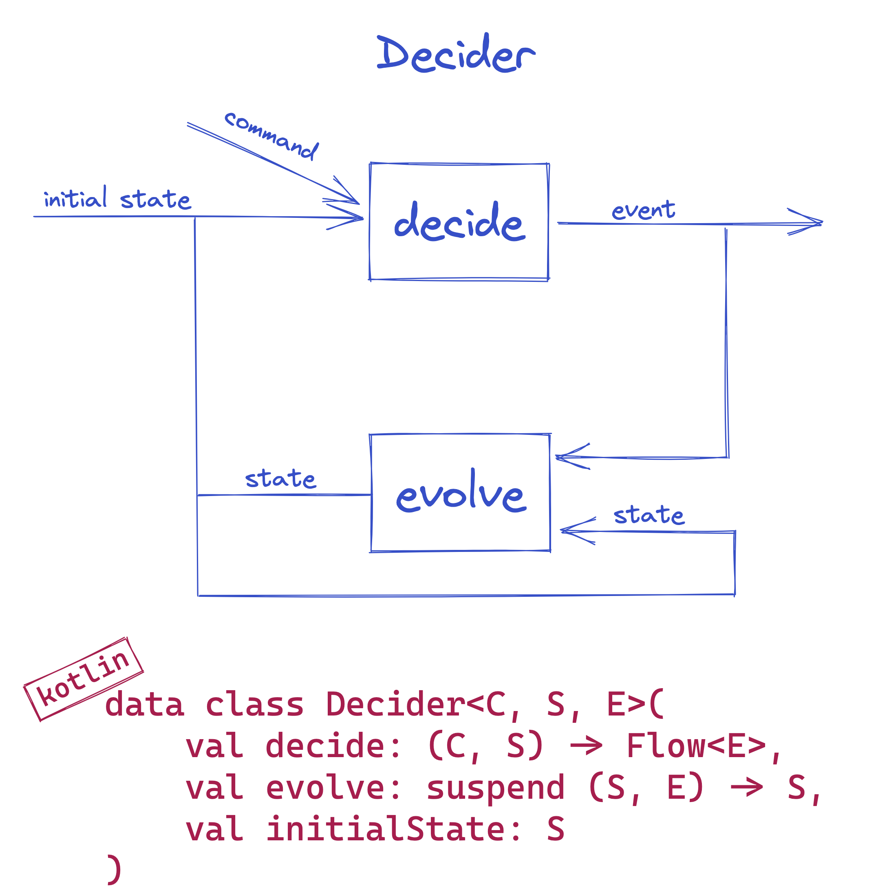
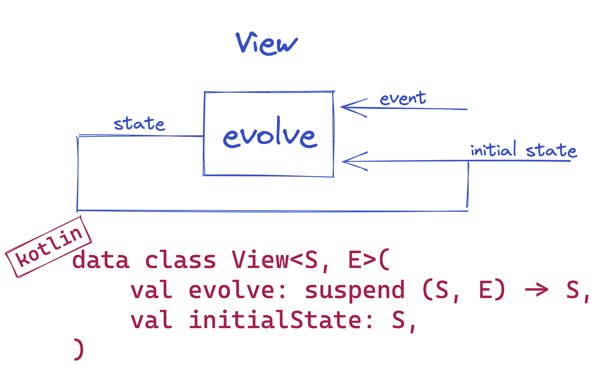
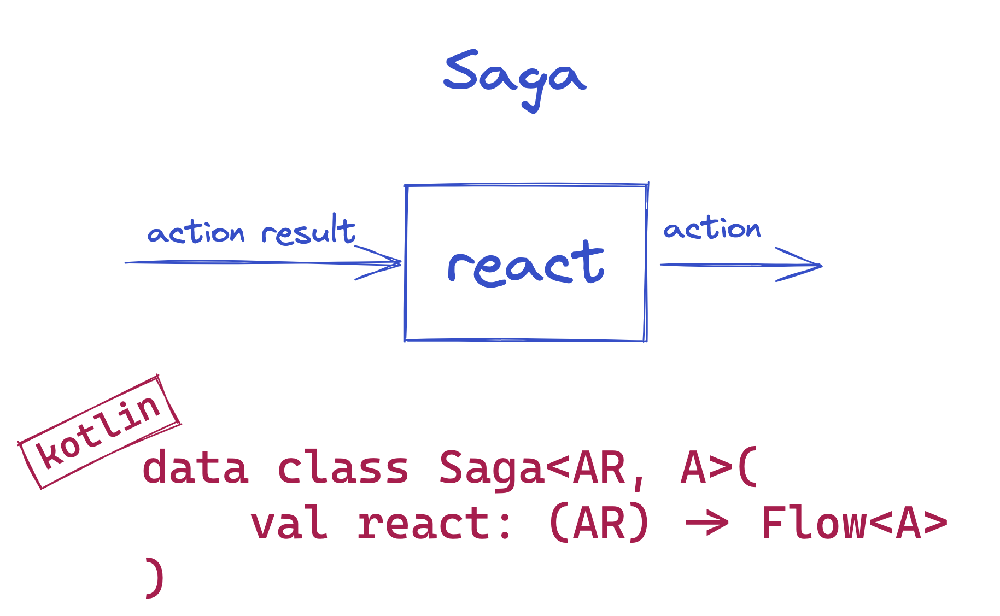

## Domain module

A pure declaration of the program logic - pure computation

### Decider

Decider is a pure domain component. It represents the main decision-making algorithm.

- `initialState` - A starting point / An initial state of type `RestaurantOrder?`
- `decide` (command handler) - A function/lambda that takes command of type `RestaurantOrderCommand?` and input state of type `RestaurantOrder?` as parameters, and returns/emits the flow of output events `Flow`<`RestaurantOrderEvent?`>
- `evolve` (event-sourcing handler) - A function/lambda that takes input state of type `RestaurantOrder?` and input event of type `RestaurantOrderEvent` as parameters, and returns the output/new state `RestaurantOrder`




```kotlin
fun restaurantOrderDecider() = Decider<RestaurantOrderCommand?, RestaurantOrder?, RestaurantOrderEvent?>(
    // Initial state of the Restaurant Order is `null`. It does not exist.
    initialState = null,
    // Exhaustive command handling part: for each type of [RestaurantCommand] you are going to publish specific events/facts, as required by the current state/s of the [RestaurantOrder].
    decide = { c, s ->
        when (c) {
            is CreateRestaurantOrderCommand -> when (s) {
                null -> flowOf(RestaurantOrderCreatedEvent(c.identifier, c.lineItems, c.restaurantIdentifier))
                else -> emptyFlow() // You can choose to publish error event, if you like
            }
            is MarkRestaurantOrderAsPreparedCommand -> when {
                (s is RestaurantOrder && CREATED == s.status) -> flowOf(RestaurantOrderPreparedEvent(c.identifier))
                else -> emptyFlow() // You can choose to publish error event, if you like
            }
            null -> emptyFlow() // We ignore the `null` command by emitting the empty flow. Only the Decider that can handle `null` command can be combined (Monoid) with other Deciders.
        }
    },
    // Exhaustive event-sourcing handling part: for each event of type [RestaurantEvent] you are going to evolve from the current state/s of the [RestaurantOrder] to a new state of the [RestaurantOrder]
    evolve = { s, e ->
        when (e) {
            is RestaurantOrderCreatedEvent -> RestaurantOrder(e.identifier, e.restaurantId, CREATED, e.lineItems)
            is RestaurantOrderPreparedEvent -> when (s) {
                is RestaurantOrder -> RestaurantOrder(s.id, s.restaurantId, PREPARED, s.lineItems)
                else -> s
            }
            is RestaurantOrderRejectedEvent -> s
            null -> s // We ignore the `null` event by returning current State. Only the Decider that can handle `null` event can be combined (Monoid) with other Deciders.
        }
    }
)
```


### View

View is a datatype that represents the event handling algorithm, responsible for translating the events into denormalized state, which is more adequate for querying.

- `initialState` - A starting point / An initial state of type `RestaurantOrderView?`
- `evolve` (event handler) - A function/lambda that takes input state of type `RestaurantOrderView?` and input event of type `RestaurantOrderEvent` as parameters, and returns the output/new state `RestaurantOrderView`



```kotlin
fun restaurantOrderView() = View<RestaurantOrderView?, RestaurantOrderEvent?>(
    // Initial state of the [RestaurantOrderView] is `null`. It does not exist.
    initialState = null,
    // Exhaustive event-sourcing handling part: for each event of type [RestaurantOrderEvent] you are going to evolve from the current state/s of the [RestaurantOrderView] to a new state of the [RestaurantOrderView].
    evolve = { s, e ->
        when (e) {
            is RestaurantOrderCreatedEvent -> RestaurantOrderView(e.identifier, e.restaurantId, CREATED, e.lineItems)
            is RestaurantOrderPreparedEvent -> when (s) {
                is RestaurantOrderView -> RestaurantOrderView(
                    s.id,
                    s.restaurantId,
                    PREPARED,
                    s.lineItems
                )
                else -> s
            }
            is RestaurantOrderRejectedEvent -> s
            null -> s // We ignore the `null` event by returning current State/s. Only the View that can handle `null` event can be combined (Monoid) with other Views.

        }
    }
)
```

### Saga

Saga is a datatype that represents the central point of control deciding what to execute next.
It is responsible for mapping different events from deciders into action result that the Saga then can use to calculate the next actions to be mapped to command of other deciders.

Saga does not maintain the state.

 - `react` - A function/lambda that takes input state of type `RestaurantEvent?`, and returns the flow of actions/commands `Flow`<`RestaurantOrderCommand`> that should be published.




```kotlin
fun restaurantOrderSaga() = Saga<RestaurantEvent?, RestaurantOrderCommand?>(
    react = { e ->
        when (e) {
            is RestaurantOrderPlacedAtRestaurantEvent -> flowOf(CreateRestaurantOrderCommand(e.restaurantOrderId, e.identifier, e.lineItems))
            is RestaurantCreatedEvent -> emptyFlow()
            is RestaurantMenuActivatedEvent -> emptyFlow()
            is RestaurantMenuChangedEvent -> emptyFlow()
            is RestaurantMenuPassivatedEvent -> emptyFlow()
            is RestaurantOrderRejectedByRestaurantEvent -> emptyFlow()
            null -> emptyFlow() // We ignore the `null` event by returning the empty flow of commands. Only the Saga that can handle `null` event/action-result can be combined (Monoid) with other Sagas.
        }
    }
)
```
